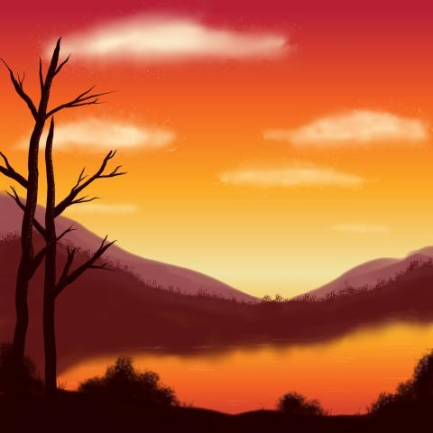
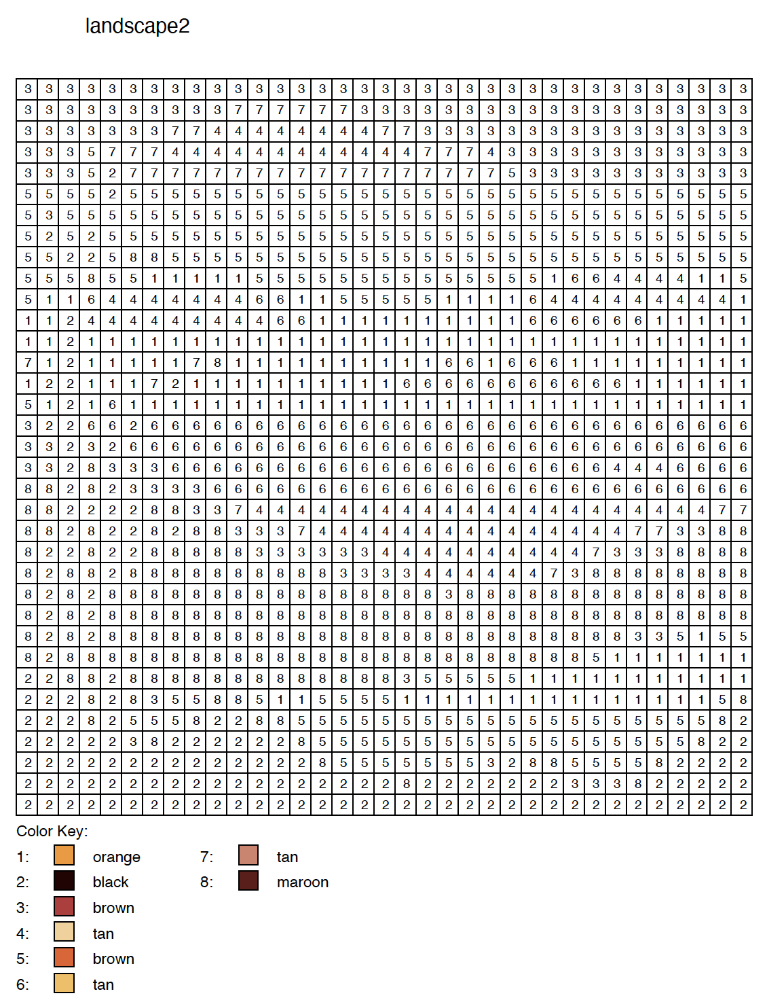

# Pixel-Color-By-Number
Generate pixel art color by number from an image.

## For My Sons

They're obsessed with these and the internet doesn't have enough cool ones.

This let's them find any pic. Like this one:

Turn it into pixel art. Like this:

And then print out a PDF of a color by number grid. Like this:

___

It's not perfect.

Yet.

But it's a real fun start!